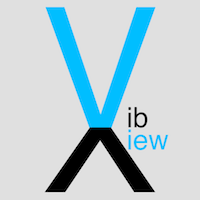
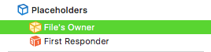
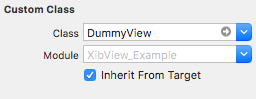
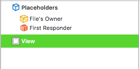
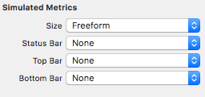
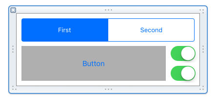
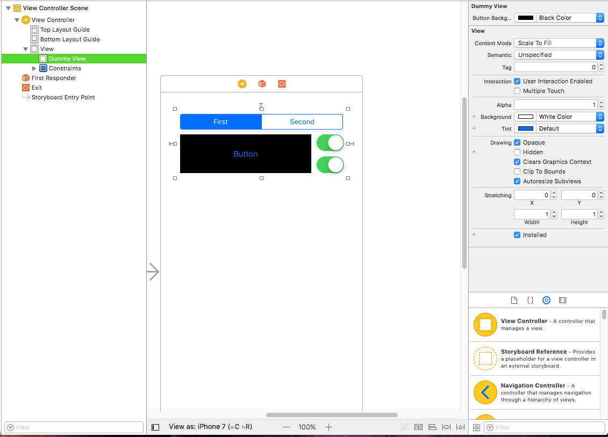

# XibView



This framework aims to simplify the process of building custom IBDesignables by
reducing boilerplate and hiding the ugly interface builder details from what
should be concise, and reusable subclasses of UIView.

[](https://travis-ci.org/kautenja/XibView)
[](http://cocoapods.org/pods/XibView)
[](http://cocoapods.org/pods/XibView)
[](http://cocoapods.org/pods/XibView)

## Example

To run the example project, clone the repo, and run build the project, also check out the storyboard to see the custom view build.

## Requirements

*   iOS10.0

## Installation

### Carthage

To install it, add the following line to your Cartfile:

```
github "Kautenja/UIXibView" "master"
```

## Workflow

The basic workflow for creating a custom IBDesignable looks like this.

1.  start with stubbing your UIView subclass

```swift
import UIXibView

@IBDesignable class DummyView: XibView {

}
```

you'll notice that instead of subclassing `UIView`, we have subclassed `XibView`
instead. What this does is associate this class directly with a xib file of the
same name. Don't worry, XibView is a subclass of UIView.
*   dont forget the `@IBDesignable` flag. without it, the interface builder
    wont know that this is a view to build.

2.  Create the xib file

Next create the `.xib` file that you will design your custom view in, it's
important that the xib filename match the class that it will be owned by. This
is how the `XibView` machinery automatically finds its xib file based on the
subclass name. In our example case the file would be called `DummyView.xib`

3.  Set the owner of the nib file to the class you stubbed.





*   **the view inside the xib should not be subclassed by the custom class**

4.  Set up the view dimensions





5.  Design your view



6.  Hookup IBOutlets, IBActions, write IBInspectables, etc.

```swift
import UIXibView

/// an example of the XibView subclassing pattern
@IBDesignable class DummyView: XibView {

    /// some segmented control
    @IBOutlet weak var segmentedControl: UISegmentedControl!

    /// some button
    @IBOutlet weak var button: UIButton!

    /// the background color of some button, can be changed
    /// in the interface builder
    @IBInspectable var buttonBackgroundColor: UIColor? {
        get {
            return button.backgroundColor
        }
        set {
            button.backgroundColor = newValue
        }
    }

    /// the top switch
    @IBOutlet weak var switchTop: UISwitch!

    /// the bottom switch
    @IBOutlet weak var switchBottom: UISwitch!

}
```

7.  Use your custom view in another view or storyboard or whatever!



## Author

kautenja, kautencreations@gmail.com

## License

XibView is available under the MIT license. See the LICENSE file for more info.
