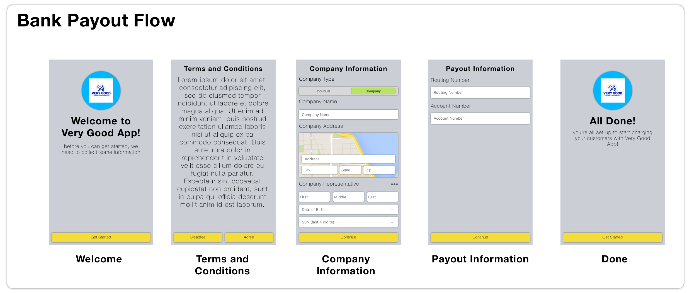

# UIBankPayoutFlow

this iOS framework delivers a concise flow for setting up payout information. It was originally
designed to be fully compatible with [Stripe][], but has since been generalized to fit a broader
audience.

[Stripe]: https://stripe.com



## Getting Started

These instructions will get you a copy of the project up and running on your 
local machine for development and testing purposes. See deployment for notes on 
how to deploy the project on a live system.

### Prerequisites

UIBankPayoutFlow is both dependency managed and distributed using 
[Carthage][], the decentralized package manager for iOS frameworks. Ensure you 
have Carthage installed by running

```shell
brew install carthage
```

if you don't have `brew` installed on your machine, get it here: [homebrew][]

[Carthage]: https://github.com/Carthage/Carthage
[homebrew]: https://brew.sh

### Installing

First install the dependencies for the project using Carthage, all these 
commands are saved in a makefile for ease of access:

```
make install
```

Once carthage finishes downloading and building the dependencies open 
[BankPayoutFlow.xcodeproj][] and build the project to ensure the 
dependency installation went smoothly

[BankPayoutFlow.xcodeproj]: ./BankPayoutFlow.xcodeproj

## Deployment

To incorporate this framework in your workflow simply add the following line to
your Cartfile:

```ruby
github "kautenja/UIBankPayoutFlow"
```

## Built With

* [UIXibView][] - Basic framework for working with xib files
* [PopupDialog][] - Basic framework for nice looking popups

[UIXibView]: https://github.com/kautenja/UIXibView
[PopupDialog]: https://github.com/orderella/PopupDialog

## Contributing

Please read [CONTRIBUTING.md][] for details on our code of conduct, and the process for submitting pull requests to us.

[CONTRIBUTING.md]: ./CONTRIBUTING.md

## Versioning

We use [SemVer](http://semver.org/) for versioning. For the versions available, 
see the [tags on this repository](https://github.com/kautenja/UIBankPayoutFlow/tags). 

## Authors

See the list of [contributors](https://github.com/kautenja/UIBankPayoutFlow/contributors) who participated in this project.

## License

This project is licensed under the MIT License - see the [LICENSE][] file 
for details

[LICENSE]: ./LICENSE
